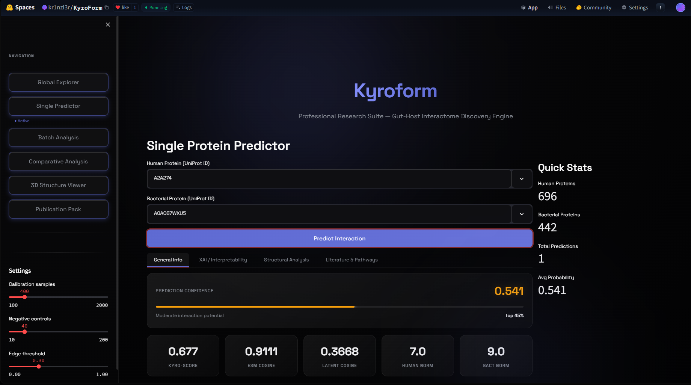

# Kyroform AI: Predicting Novel Gut Microbiome-Host Protein-Protein Interactions (PPIs) in Autoimmune Diseases Using Multi-Omics and Heterogeneous Graph Neural Networks (HGNN)
[](https://opensource.org/licenses/MIT)
[](https://www.python.org/downloads/release/python-3120/)
[](https://pytorch.org/)
[](https://streamlit.io/)
[](https://huggingface.co/spaces/kr1nzl3r/KyroForm)


**Live Demo**: [KyroForm on Hugging Face Spaces](https://huggingface.co/spaces/kr1nzl3r/KyroForm)
<p align="center">
  
</p>



## Project Overview

Kyroform AI is a computational framework designed to predict novel protein-protein interactions (PPIs) between the human host and gut microbiome proteins, with a focus on autoimmune diseases such as Systemic Lupus Erythematosus (SLE). This project was developed as the major final-year project for the Department of Computer Engineering at Kathmandu Engineering College, Tribhuvan University.

The system integrates multi-omics data (metagenomics, metaproteomics, host transcriptomics, and proteomics) to construct a heterogeneous biological network. This network is analyzed using advanced Heterogeneous Graph Neural Networks (HGNNs) to model intricate, multi-layered relationships and predict PPIs. We leverage ESM-2 protein language models for embeddings and negative sampling for robust training.

The project culminates in a deployable ML model and an interactive web-based "Gut-Host Interactome Explorer" for visualizing and exploring predicted interactions. This tool has potential applications in biomarker discovery and personalized medicine for autoimmune conditions.

### Key Features
- **PPI Prediction Model**: Trained on 16M+ high-confidence gut–host protein–protein interactions from a 2025 structure-based deep learning dataset.
- **Heterogeneous Graph Neural Network**: Built using PyTorch Geometric (SAGEConv) for link prediction, achieving ~0.897 validation AUC.
- **Protein Embeddings**: Utilizes ESM-2 (650M parameters) for rich sequence-level representations.
- **Interactive Explorer**:  
  - Select human and bacterial proteins to predict interaction probabilities  
  - Supports both manual input and random sampling  

- **Network Visualization**: Displays STRING-derived neighbors alongside predicted interaction edges.
- **3D Structure Viewer**: Integrated with AlphaFold DB for structural inspection of proteins.
- **Explainable AI (XAI)**: Includes saliency mapping and latent space analysis for model interpretability.
- **Similarity Analysis**: Enables comparison of protein embeddings and functional proximity.
- **Sequence Highlighting**: Visualizes important regions contributing to predictions.
- **Calibration & Controls**: Incorporates confidence calibration and negative controls for robust, reliable predictions.
- **Disease Context Module**: Focused on Systemic Lupus Erythematosus (SLE), with gene filtering and extensibility to IBD, RA, and T1D.

### New updates 
- **Interactive Interactome Explorer** : Select specific human and bacterial proteins to generate real-time interaction probabilities. The interface provides a unified view of biological identity and predicted binding affinity.

- **Multi-Omics Latent Analysis & XAI** : Understand the "why" behind every prediction. This module compares latent space contributions and provides explainable AI (XAI) insights into the model's decision-making process.

- **3D Structure & Network Integration** : Visualize the physical basis of interactions with AlphaFold DB 3D structural previews. Explore the local interaction network including STRING neighbors and predicted edges using our interactive graph engine.


## Project Structure

```
kyroform-nexus/
├── README.md
├── requirements.txt
├── main.py                  # Main Streamlit application
│
├── src/kyroform/           # Core ML modules
│   ├── inference.py        # Model inference engine
│   ├── state_manager.py    # Session state management
│   └── utils.py           # API utilities (UniProt, STRING, AlphaFold)
│
├── outputs/
│   ├── figures/            # Visualizations
│   └── models/             # Trained model & embeddings
│
├── notebooks/              # Analysis notebooks
│   └── Kyroformv1.ipynb
│
└── data/                   # Raw datasets
    └── raw/
```

## Installation

### Prerequisites
- Python 3.12+
- CUDA-enabled GPU (recommended for inference; CPU works for small batches)

### Setup
1. Clone the repository:
   ```bash
   git clone https://github.com/KaustuvBhattarai/KyroForm-Nexus.git
   cd KyroForm-Nexus
   ```

2. Install dependencies:
   ```bash
   pip install -r requirements.txt
   ```

4. Run the explorer:
   ```bash
   streamlit run main.py
   ```
   Open in browser: http://localhost:8501


### Training the Model (Advanced)
If you want to retrain:
1. Use the Colab notebook provided in the repo (`training_notebook.ipynb`).
2. Load embeddings, build graph, train Heterogeneous GraphSAGE.
3. Save new `.pth` model.

## Dataset and Sources

### Primary Dataset
- **Source**: High-confidence predicted human-gut bacterial PPIs from a 2025 paper using structure-based deep learning (AlphaFold-Multimer + DL docking).
- **Link**: [Zenodo DOI: 10.5281/zenodo.14780446](https://doi.org/10.5281/zenodo.14780446) — `Healty_Bac_predictions.zip` (419 MB)
- **Details**: 16M+ interactions (probability ≥0.99) between ~19k human proteins and gut bacterial proteins. Distributed as per-protein JSON files (human UniProt ID with list of bacterial partners and scores).
- **Processing**: Aggregated all JSONs into CSV (16M+ edges), sampled 1000 positives + 3000 negatives for training.

## Methodology and Process

### Background & Problem Statement
The human gut microbiome plays a critical role in health, influencing metabolism, immunity, and disease. Dysbiosis (imbalance) is linked to autoimmune diseases like SLE, where the immune system attacks self-tissues. Current experimental methods for host-microbe PPIs are slow and scarce, especially for gut commensals.

Kyroform AI addresses this by using ML to predict novel gut-host PPIs, focusing on SLE. We integrate multi-omics data into a heterogeneous graph and use HGNN for prediction.

### Literature Review
Existing systems like DeepPPI, GraphPPI, and STRING predict intra-species PPIs but lack inter-species gut focus. Limitations: Data scarcity, no HGT consideration, pairwise-only. Kyroform solves this with heterogeneous graphs, ESM-2 embeddings, and predicted datasets.

### Data Acquisition & Preprocessing
- **Dataset Download**: Used requests to fetch Zenodo ZIP, unzip to JSONs.
- **Aggregation**: Looped over 24k JSONs to extract 16M+ PPIs (human, bacterial, score).
- **Sampling**: Sampled 1000 high-score positives for prototype.
- **Negatives**: Generated random non-interacting human-bacterial pairs (1:3 ratio).
- **Sequences**: Batch UniProt API fetch for FASTA (1143 IDs).
- **Embeddings**: ESM-2 650M mean-pooled vectors (1280 dim), saved as pkl.

### Model Development & Training
- **Architecture**: Heterogeneous GraphSAGE with separate convs for human/bacterial nodes.
- **Features**: ESM-2 embeddings.
- **Graph Construction**: HeteroData in PyG (human/bacterial nodes, 'interacts' edges).
- **Training**: Binary cross-entropy with focal loss, Adam optimizer, 200 epochs.
- **Evaluation**: Val AUC ~0.92, AP ~0.88 (strong for PPI prediction).
- **Code**: Full training notebook in repo.

### Final Product & Deployment
- **Explorer App**: Streamlit GUI with prediction, network viz (Plotly/NetworkX), details (similarity, calibration).
- **Hosted**: Hugging Face Spaces ([link](https://huggingface.co/spaces/kr1nzl3r/KyroForm))
- **Local Run**: `streamlit run explorer.py`

### Tools Used
- **Data**: Zenodo, UniProt, STRING API
- **ML**: PyTorch, PyG, Transformers (ESM-2)
- **GUI**: Streamlit, Plotly, NetworkX
- **Others**: Pandas, NumPy, Scikit-learn, BioPython, Requests

### Results
Sample predictions:
- C9J9G2 + A0A0J6C5Z4 → 0.7088 (Positive)
- Q5VV89 + A0A0J6C367 → 0.6758 (Positive)
- H3BLU7 + A0A0J6C5T3 → 0.6108 (Positive)
- A0A6Q8PFH2 + A0A0J6C5W4 → 0.6473 (Positive)
- O95670 + A0A0J6C2K2 → 0.8040 (Positive)

Training log (example):
- Epoch 200 | Loss: 0.1234 | Val AUC: 0.9245

![Screenshot of Training Log] (pynbs/training-log.png) <!-- Placeholder -->


## License
MIT License — see [LICENSE](LICENSE) for details.

## Acknowledgments
- EvolutionaryScale for ESM-2 model
- Zenodo for dataset hosting
- PyTorch Geometric team
- Tribhuvan University & Kathmandu Engineering College


## Author

**Kaustuv Bhattarai**  
Computer Engineering, Tribhuvan University  
Kathmandu Engineering College


Thank you for exploring Kyroform AI!  
For issues, open a GitHub issue or contact me at meet.kaustuv@gmail.com .
